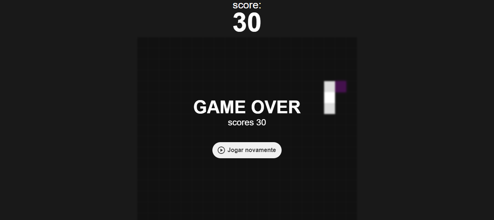

# Snake Game

Este é um projeto simples do clássico jogo da cobrinha desenvolvido como parte de estudos em JavaScript, HTML e CSS.

## Como Jogar

1. Abra o arquivo `index.html` em seu navegador da web preferido.
2. Use as setas do teclado para controlar a direção da cobrinha.
3. Tente pegar as comidas que aparecem no campo de jogo sem colidir com as bordas ou com o próprio corpo da cobrinha.
4. Quanto mais comidas você pegar, mais a cobrinha irá crescer, aumentando a dificuldade do jogo e aumentando o seu score.

## Recursos

- **HTML:** A estrutura básica da página web.
- **CSS:** Estilos para a aparência do jogo.
- **JavaScript:** Lógica de programação para controlar o movimento da cobrinha, detectar colisões e gerar frutas aleatórias.

## Estrutura de Arquivos

- **index.html:** Página principal do jogo.
- **style.css:** Arquivo de estilo para a aparência do jogo.
- **script.js:** Arquivo JavaScript contendo toda a lógica do jogo.

